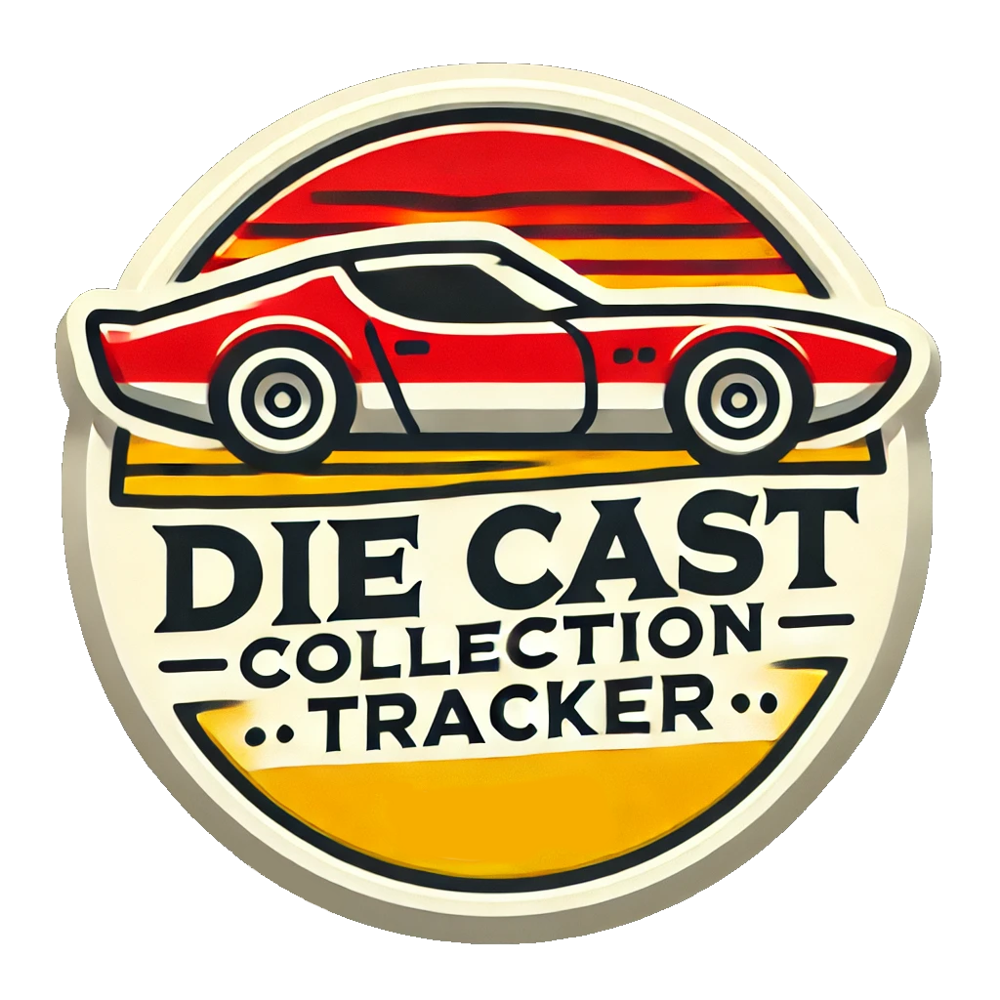

# Die Cast Collection Tracker



A web application to track your die cast collection. Built with **React** for the frontend, **Node.js** for the backend, and **MongoDB** for the database. The application allows you to add, edit, delete, and search for cars in your collection. It also supports uploading photos of your cars.

---

## Features

- **Add Cars:** Add new die cast to your collection with details like name, model, year, and color.
- **Edit Cars:** Update details of existing cars in your collection.
- **Delete Cars:** Remove cars from your collection.
- **Search Cars:** Search for cars by name, model, or year.
- **Photo Upload:** Upload photos of your die cast.
- **Responsive Design:** The app is fully responsive and works on all devices.

---

## Technologies Used

- **Frontend:** React, Axios
- **Backend:** Node.js, Express, MongoDB
- **Database:** MongoDB
- **Containerization:** Docker
- **Deployment:** Docker Hub

---

## Installation

### Prerequisites

- [Docker](https://docs.docker.com/get-docker/)
- [Docker Compose](https://docs.docker.com/compose/install/)
- [Node.js](https://nodejs.org/) (for development only)

---

### For Development

1. **Clone the Repository:**

    ```bash
    git clone https://github.com/your-username/diecastcollectiontracker-collection.git
    cd diecastcollectiontracker-collection
    ```

2. **Set Up Environment Variables:**

    Create a `.env` file in the [backend](http://_vscodecontentref_/1) and [frontend](http://_vscodecontentref_/2) directories with the following content:

    **backend/.env.development:**
    ```env
    MONGO_URI=mongodb://localhost:27017/diecastcollectiontracker
    ```

    **frontend/.env.development:**
    ```env
    REACT_APP_API_URL=http://localhost:2105
    ```

3. **Start the Development Environment (Backend):**

    ```bash
    cd backend
    node index.js
    ```

    This will start the MongoDB, and backend services.

4. **Start the Development Environment (Frontend):**

    ```bash
    cd frontend
    npm start
    ```

    This will start the frontend services.

---

### For Production

1. **Clone the Repository:**

    ```bash
    git clone https://github.com/your-username/diecastcollectiontracker-collection.git
    cd diecastcollectiontracker-collection
    ```

2. **Set Up Environment Variables:**

    Create a `.env` file in the [backend](http://_vscodecontentref_/3) and [frontend](http://_vscodecontentref_/4) directories with the following content:

    **backend/.env.production:**
    ```env
    MONGO_URI=mongodb://diecastcollectiontracker-mongo:27017/diecastcollectiontracker
    ```

    **frontend/.env.production:**
    ```env
    REACT_APP_API_URL=http://your-production-url
    ```

3. **Build and Start the Production Environment:**

    ```bash
    docker compose build --no-cache
    docker compose up -d
    ```

    This will build and start the MongoDB, backend, frontend, and Nginx services.

---

## License

This project is licensed under the MIT License - see the LICENSE file for details.